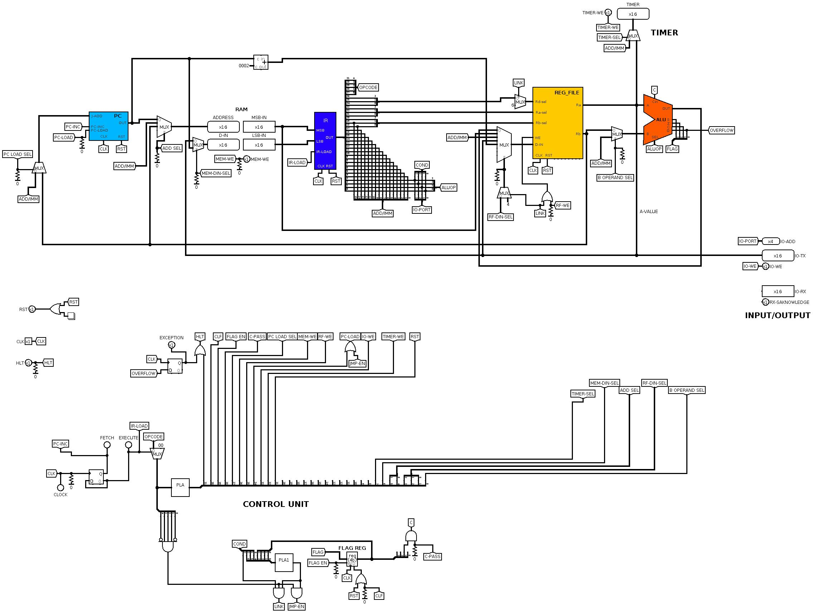

# Thunderbolt16
Thunderbolt16 is a 16 bit non piplined RISC processor.

it supports a 32bit instruction set architecture. 64KB of address space and Dedicate IO instructions.
ISA is proded in file "OP_excel.ods" file

TbAssembler is a two pass assembler that assembles 'code.txt' file into bytecode sequece (code_bytecode.txt) that can be loaded into RAM during Logisim simulation.

The command line syntax of Assembler is as follows:
python assembler.py <filename>.txt <debug flag>
  file name: it is of .txt format
  debug flag: '-d' : prints address mapping of all detected commands, labels, variables and output bytecode sequence.
  

Assembly language reference & sample codes will be uploaded in upcoming commits.

